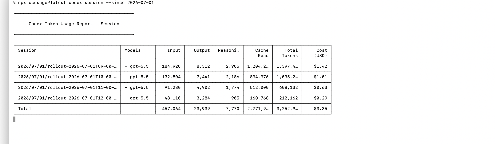
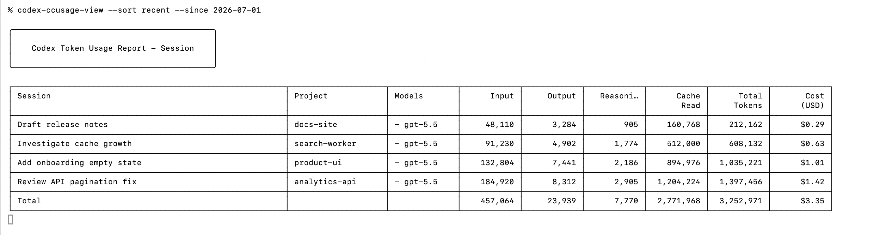

# codex-ccusage-view

See what each Codex thread costs, with readable titles instead of rollout IDs.

`ccusage` already calculates the tokens and cost. This tool keeps the
ccusage-style table, then replaces rollout hashes with the Codex thread title
and a compact project label.

## Before



## After



## How It Works

The ccusage session id is the relative rollout file path under
`~/.codex/sessions`. Codex Desktop stores the matching absolute rollout path in
`~/.codex/state_5.sqlite`, table `threads`, column `rollout_path`.

`codex-ccusage-view` joins those records and falls back to the thread UUID plus
`~/.codex/sqlite/codex-dev.db` when needed.

## Install

```sh
git clone https://github.com/bdamokos/codex-ccusage-view.git
cd codex-ccusage-view
python3 -m pip install -e .
```

You can also run the script directly from a checkout.

## Examples

Run ccusage directly and print a ccusage-style session table:

```sh
codex-ccusage-view --run-ccusage --since 2026-07-01 --timezone Europe/Brussels
```

Refresh the table every minute:

```sh
codex-ccusage-view --run-ccusage --since 2026-07-01 --timezone Europe/Brussels --sort cost --watch 60
```

Watch mode repaints the same terminal screen instead of adding a new table on
each refresh.

Show the most recently updated Codex threads first:

```sh
codex-ccusage-view --run-ccusage --since 2026-07-01 --timezone Europe/Brussels --sort recent
```

Pipe an existing ccusage JSON export:

```sh
npx --yes ccusage@latest codex session --json --since 2026-07-01 --timezone Europe/Brussels \
  | codex-ccusage-view
```

Export enriched JSON:

```sh
codex-ccusage-view --run-ccusage --since 2026-07-01 --format json > usage-with-codex-titles.json
```

Export CSV:

```sh
codex-ccusage-view --run-ccusage --since 2026-07-01 --format csv > usage-with-codex-titles.csv
```

## Sort Modes

- `session`: ccusage session order
- `recent`: most recently updated Codex threads first
- `cost`: highest cost first
- `tokens`: highest token count first
- `title`: alphabetical by Codex thread title

## Privacy

- Reads local Codex Desktop SQLite databases in read-only mode.
- Does not write to Codex state.
- Does not upload usage data.
- Calls `npx --yes ccusage@latest` only when `--run-ccusage` is used.

## License

MIT
